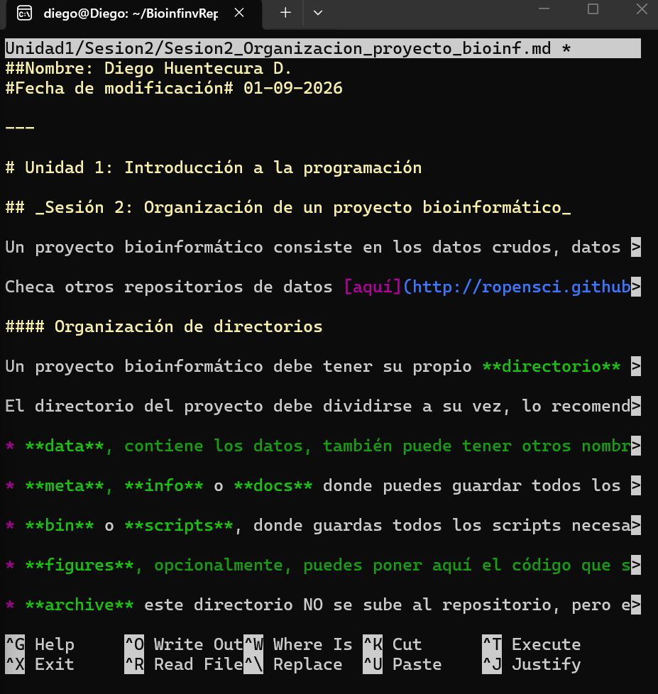

# Resultados
## ¿Qué se solicitaba?
### Incluir la fecha y mi nombre
Se completó la tarea con éxito al modificarla en la copia local del repositorio.

---

## Pantallazo 1: Incorporación de los cambios
En la siguiente imagen se evidencia los cambios realizados en el archivo

## Pantallazo 2: Revisión de los cambios

Aquí se muestran los cambios realizados en el editor de Markdown.

---

## Pantallazo 3: Estado del repositorio

Luego de realizar el commit se ejecutó:

`git status`

El resultado indica que para publicar el commits, se puede utilizar "git push".

