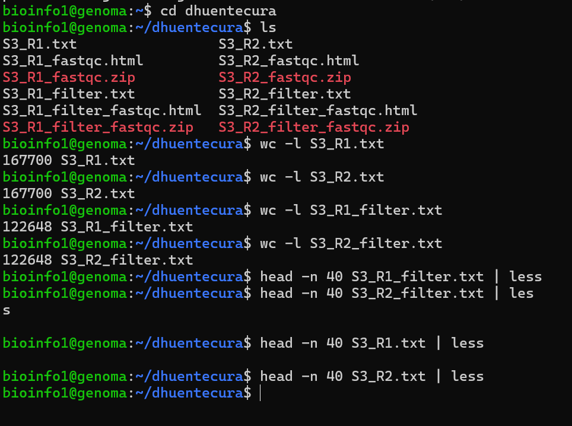
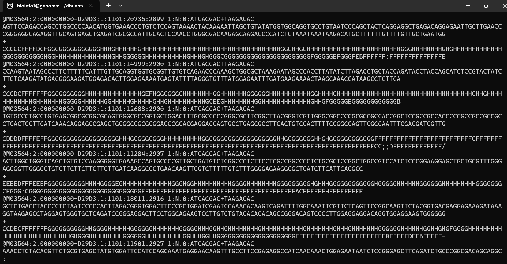
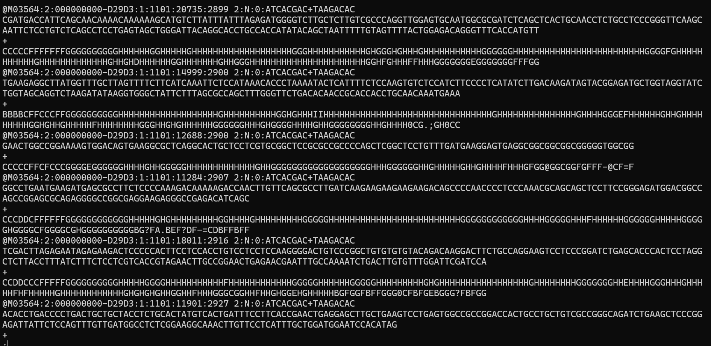
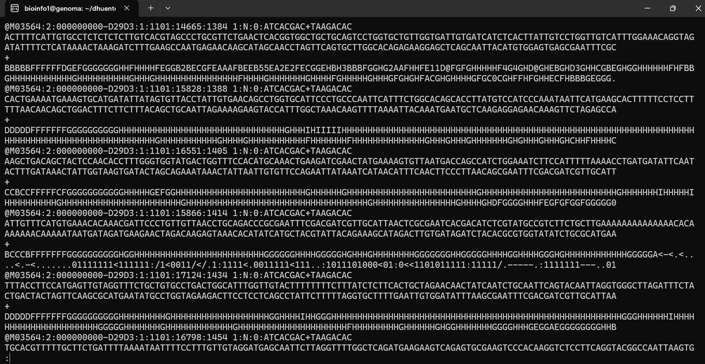
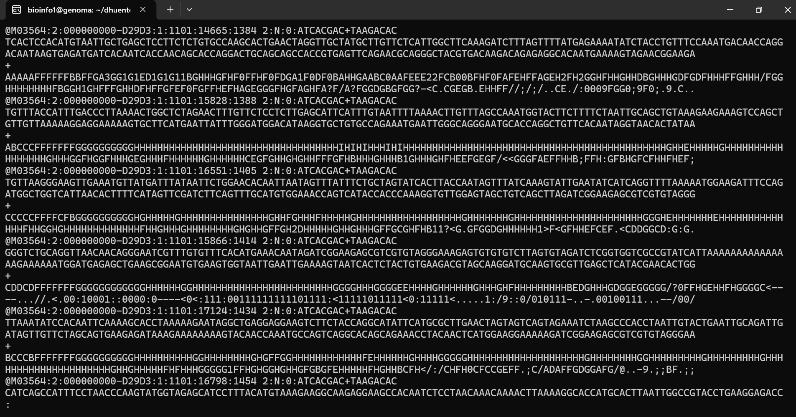
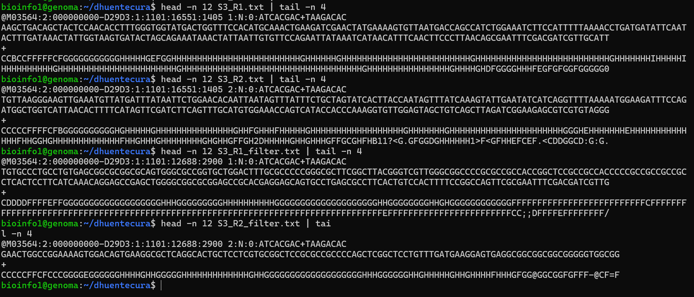
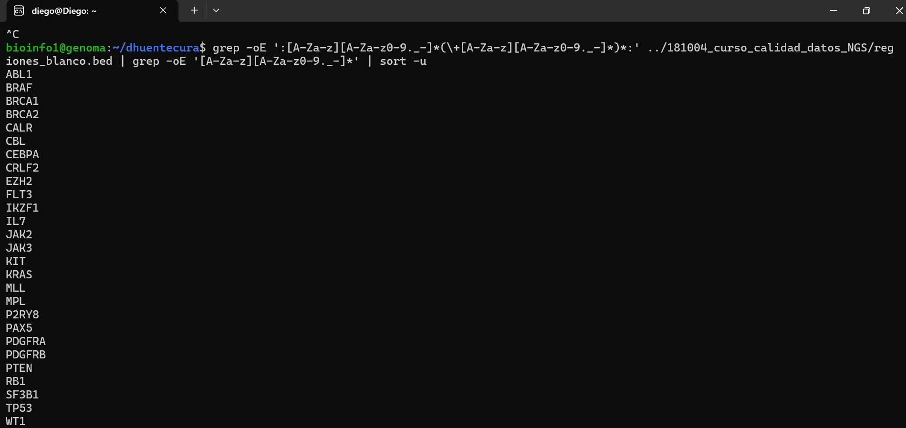

## Conteo del número de reads

Para determinar el número de reads se utilizó el comando `wc -l`, que permite contar el número de líneas de cada archivo.

```bash
wc -l S3_R1.txt
wc -l S3_R2.txt
wc -l S3_R1_filter.txt
wc -l S3_R2_filter.txt
```

A continuación se muestra la ejecución de los comandos en la consola:



## Se obtuvieron los siguientes valores:

| Archivo          | Número de líneas | Número de reads |
| ---------------- | ---------------- | --------------- |
| S3_R1.txt        | 167700           | 41925           |
| S3_R2.txt        | 167700           | 41925           |
| S3_R1_filter.txt | 122648           | 30662           |
| S3_R2_filter.txt | 122648           | 30662           |

Debido a que cada read en formato FASTQ está compuesto por 4 líneas, el número total de líneas se debe dividir por 4 para obtener la cantidad real de reads.

Los cálculos quedaron de la siguiente manera:

```text
167700 / 4 = 41925 reads
122648 / 4 = 30662 reads
```

Después del proceso de filtrado, quedaron **30662 de los 41925 reads originales**, correspondientes aproximadamente al **73,1 % de las lecturas**.

## Previsualización de las primeras 40 líneas

Para este caso, usé `head` junto con `less` para mostrar solamente las primeras 40 líneas y evitar llenar la consola con toda la información de los archivos.

```bash
head -n 40 S3_R1.txt | less
head -n 40 S3_R2.txt | less
head -n 40 S3_R1_filter.txt | less
head -n 40 S3_R2_filter.txt | less
```

A continuación se muestran las imágenes de cada archivo previsualizado en su parte inicial.

### S3_R1.txt



### S3_R2.txt



### S3_R1_filter.txt



### S3_R2_filter.txt



## Visualizar el tercer read

Ya que cada read tiene 4 líneas, se debe considerar que vienen en grupos de cuatro. Es decir, el primer read corresponde a las líneas 1-4, el segundo a las líneas 5-8 y el tercero a las líneas 9-12.

Considerando esta información, se utilizó el siguiente comando:

```bash
head -n 12 S3_R1.txt | tail -n 4
```

A continuación se muestra la ejecución del comando:



### Visualización del tercer read crudo

```text
@M03564:2:000000000-D29D3:1:1101:16551:1405 1:N:0:ATCACGAC+TAAGACAC
AAGCTGACAGCTACTCCAACACCTTTGGGTGGTATGACTGGTTTCCACATGCAAACTGAAGATCGAACTATGAAAAGTGTTAATGACCAGCCATCTGGAAATCTTCCATTTTTAAAACCTGATGATATTCAATACTTTGATAAACTATTGGTAAGTGATACTAGCAGAAATAAACTATTAATTGTGTTCCAGAATTATAAATCATAACATTTCAACTTCCCTTAACAGCGAATTTCGACGATCGTTGCATT
+
CCBCCFFFFFCFGGGGGGGGGGGHHHHHGEFGGHHHHHHHHHHHHHHHHHHHHHHHHHGHHHHHHGHHHHHHHHHHHHHHHHHHHHHHHHHGHHHHHHHHHHHHHHHHHHHHHHHHHHGHHHHHHHIHHHHHIHHHHHHHHHHGHHHHHHHHHHHHHHHHHHHHHGHHHHHHHHHHHHHHHHHHHHHHHHHHHHHHHHHHHGHHHHHHHHHHHHHHGHHHHGHDFGGGGHHHFEGFGFGGFGGGGG0
```

### Análisis del tercer read

| Campo               | Valor             |
| ------------------- | ----------------- |
| Identificador       | M03564            |
| Corrida             | 2                 |
| Flow cell           | 000000000-D29D3   |
| Lane                | 1                 |
| Tile                | 1101              |
| Coordenada X        | 16551             |
| Coordenada Y        | 1405              |
| Read                | 1                 |
| Filtro              | N                 |
| Control             | 0                 |
| Secuencia de índice | ATCACGAC+TAAGACAC |

La información de calidad se puede visualizar en la cuarta línea del read. De acuerdo con el carácter presente, se puede determinar la calidad correspondiente a cada base.

## Traducción del código de calidad para las 10 primeras bases del tercer read a valores numéricos

### Bases

```text
AAGCTGACAG
```

### Caracteres de calidad

```text
CCBCCFFFFF
```

En este caso se utilizó la codificación PHRED+33.

```text
Bases:   A  A  G  C  T  G  A  C  A  G
Calidad: C  C  B  C  C  F  F  F  F  F
Q:      34 34 33 34 34 37 37 37 37 37
```

Se puede observar que todas estas bases presentan valores superiores a **Q30**, lo que indica una alta calidad para esta región de la lectura.

## Regiones en blanco del panel

Se examinó el archivo utilizando el siguiente comando:

```bash
head ../181004_curso_calidad_datos_NGS/regiones_blanco.bed
```

Las primeras líneas correspondieron a regiones genómicas, por ejemplo:

```text
chr2    198264773    198265665    chr2:198264773:198265665:SF3B1+SF3B1+SF3B1:UserDefined
```

Luego se contó el número de líneas utilizando:

```bash
wc -l ../181004_curso_calidad_datos_NGS/regiones_blanco.bed
```

Obteniendo como resultado:

```text
369 ../181004_curso_calidad_datos_NGS/regiones_blanco.bed
```

Por lo tanto, se identificaron **369 regiones blanco**.

## Lista de símbolos de genes distintos

Para poder analizar la cantidad de genes presentes en el archivo BED, se utilizó `grep -oE` para extraer los símbolos de genes y finalmente `sort -u` para eliminar los valores repetidos.

```bash
grep -oE ':[A-Za-z][A-Za-z0-9._-]*(\+[A-Za-z][A-Za-z0-9._-]*)*:' ../181004_curso_calidad_datos_NGS/regiones_blanco.bed | grep -oE '[A-Za-z][A-Za-z0-9._-]*' | sort -u
```

El resultado obtenido en la consola fue el siguiente:



### Genes identificados

1. ABL1
2. BRAF
3. BRCA1
4. BRCA2
5. CALR
6. CBL
7. CEBPA
8. CRLF2
9. EZH2
10. FLT3
11. IKZF1
12. IL7
13. JAK2
14. JAK3
15. KIT
16. KRAS
17. MLL
18. MPL
19. P2RY8
20. PAX5
21. PDGFRA
22. PDGFRB
23. PTEN
24. RB1
25. SF3B1
26. TP53
27. WT1

Se añadió una numeración al inicio para facilitar el análisis, pudiéndose identificar un total de **27 genes diferentes**.
