## 2 Generación de informes de calidad con FastQC

Para evaluar la calidad de las secuencias se utilizó el programa FastQC sobre la muestra S3.

Se generaron informes independientes para las lecturas R1 y R2. Además, se analizaron ambas condiciones.

### 2.1 Secuencias crudas

Para R1 y R2 se usó respectivamente:

```
fastqc ../181004_curso_calidad_datos_NGS/fastq_raw/S3_R1.fastq.gz -o .

fastqc ../181004_curso_calidad_datos_NGS/fastq_raw/S3_R2.fastq.gz -o .

```
Posterior a esto se obtuvieron los siguientes archivos
```
S3_R1_fastqc.html
S3_R1_fastqc.zip
S3_R2_fastqc.html
S3_R2_fastqc.zip
```
### 2.2 Secuencias podadas

Para R1 y R2 se usó respectivamente:

```
fastqc ../181004_curso_calidad_datos_NGS/fastq_filter/S3_R1_filter.fastq.gz -o .

fastqc ../181004_curso_calidad_datos_NGS/fastq_filter/S3_R2_filter.fastq.gz -o .
```

Posterior a esto se obtuvieron los siguientes archivos
```
S3_R1_filter_fastqc.html
S3_R1_filter_fastqc.zip
S3_R2_filter_fastqc.html
S3_R2_filter_fastqc.zip
```

### 2.3 Descarga de los archivos

Los informes HTML generados por FastQC fueron transferidos desde el servidor al computador mediante el siguiente script
```
scp bioinfo1@genoma.med.uchile.cl:dhuentecura/S3*_fastqc.html .
```
### 2.4 Analisis y comparación de los archivos

#### 2.4.1 Análisis comparativo de calidad de R1 antes y después del filtrado

Se compararon los resultados de FastQC de `S3_R1_fastqc.html` y `S3_R1_filter_fastqc.html` para ver qué cambios ocurrieron después del filtrado.

En el archivo R1 crudo había 41925 secuencias de 251 pb. Después del filtrado quedaron 30662 secuencias, con longitudes entre 35 y 251 pb.

La calidad por base (`Per base sequence quality`) fue buena tanto antes como después del filtrado. Sin embargo, se observaron mejoras en otros parámetros. Por ejemplo, `Per base sequence content` pasó de `WARNING` a `PASS`, y `Adapter Content` pasó de `FAIL` a `PASS`. Esto muestra que el filtrado ayudó a mejorar la composición de las bases y a eliminar los adaptadores presentes en las secuencias originales.

En cambio, `Sequence Length Distribution` pasó de `PASS` a `WARNING`. Esto se debe a que antes todas las secuencias tenían 251 pb, pero después del trimming quedaron con diferentes longitudes. Esto es esperable, ya que algunas lecturas fueron recortadas más que otras.

También hubo parámetros que no mejoraron. `Per sequence GC content` y `Sequence Duplication Levels` siguieron en `FAIL`, mientras que `Overrepresented Sequences` permaneció en `WARNING`. Por lo tanto, después del filtrado todavía se observaron problemas relacionados con el contenido GC, la duplicación de secuencias y algunas secuencias que aparecían con mayor frecuencia.

En general, el filtrado mejoró la calidad de R1, principalmente por la eliminación de adaptadores y la mejora en la composición de bases. Sin embargo, todavía quedaron algunas alertas que no fueron corregidas con este proceso.

#### 2.4.2 Análisis comparativo de calidad de R2 antes y después del filtrado

También se compararon los resultados de `S3_R2_fastqc.html` y `S3_R2_filter_fastqc.html`.

En el archivo R2 crudo había 41925 secuencias de 251 pb. Después del filtrado quedaron 30662 secuencias, lo que corresponde aproximadamente al 73,1 % de las lecturas originales. Las secuencias filtradas quedaron con longitudes entre 35 y 251 pb. El porcentaje de GC cambió muy poco, pasando de 44 % a 43 %.

En R2 se observó una mejora clara en `Per base sequence quality`. Antes del filtrado este parámetro estaba en `WARNING`, principalmente porque la calidad bajaba hacia el final de las lecturas. Después del filtrado pasó a `PASS`, lo que indica que las zonas de menor calidad fueron eliminadas o recortadas.

`Per base sequence content` también mejoró, pasando de `FAIL` a `PASS`. Esto indica que la proporción de A, T, C y G quedó más equilibrada a lo largo de las secuencias después del procesamiento.

Otro cambio importante fue en `Adapter Content`, que pasó de `FAIL` a `PASS`. Esto muestra que el filtrado fue efectivo para eliminar los adaptadores presentes en los reads originales.

Al igual que en R1, `Sequence Length Distribution` pasó de `PASS` a `WARNING`, debido a que después del trimming las secuencias quedaron con diferentes longitudes. Esto es un resultado esperado del proceso de recorte.

Por otro lado, algunos parámetros siguieron presentando problemas. `Sequence Duplication Levels` se mantuvo en `FAIL` y `Overrepresented Sequences` continuó en `WARNING`. Además, `Per sequence GC content` pasó de `WARNING` a `FAIL`, por lo que el filtrado no logró corregir esta desviación.

En general, el filtrado mejoró bastante la calidad de R2, principalmente en la calidad por base, la composición de nucleótidos y la eliminación de adaptadores. Sin embargo, todavía quedaron algunas alertas relacionadas con el contenido GC, la duplicación y las secuencias sobrerrepresentadas.


### 2.5 Comparación entre los valores calculados manualmente y FastQC

En el punto 1 se calculó manualmente la cantidad de reads, considerando que cada lectura en formato FASTQ está formada por cuatro líneas.

Para las secuencias crudas se obtuvieron 167700 líneas:

167700 / 4 = 41925 reads

En el caso de las secuencias podadas se obtuvieron 122648 líneas:

122648 / 4 = 30662 reads

Al comparar estos resultados con los valores entregados por FastQC, se puede ver que coinciden exactamente:
```
| Archivo   | Reads calculados manualmente | Total Sequences en FastQC |
| ----------| ---------------------------- | ------------------------- |
| R1 crudo  | 41925                        | 41925                     |
| R2 crudo  | 41925                        | 41925                     |
| R1 podado | 30662                        | 30662                     |
| R2 podado | 30662                        | 30662                     |
```
Esto muestra que el conteo manual realizado con comandos de Unix coincide con el número total de secuencias informado por FastQC.

Además, en el punto 1 también se revisaron los valores de calidad PHRED de las primeras bases de una lectura. En R1 crudo se obtuvieron valores entre Q33 y Q37, mientras que en R2 crudo se observaron valores entre Q34 y Q37 en las primeras diez bases. Estos valores indican que esa parte de las lecturas presenta una buena calidad.

FastQC permite complementar este análisis, ya que no revisa solo una lectura, sino todas las lecturas y todas sus posiciones. En R1 crudo, el módulo `Per base sequence quality` obtuvo `PASS`, mientras que en R2 crudo apareció como `WARNING`. Después del filtrado, tanto R1 como R2 pasaron a `PASS`, lo que muestra una mejora general en la calidad de las lecturas después del procesamiento.

En general, los resultados calculados manualmente son coherentes con los obtenidos mediante FastQC. El número de reads coincide exactamente y los valores de calidad PHRED observados en las primeras bases también son compatibles con la buena calidad mostrada en los informes de FastQC.


### 2.6 Comparación de las principales figuras de calidad

Para comparar la calidad de las secuencias crudas y podadas de R1 y R2 se seleccionaron cuatro análisis principales de FastQC: calidad por base, contenido de bases por posición, contenido de adaptadores y distribución de la longitud de las secuencias.

## 2.6 Comparación de las principales figuras de calidad

Para comparar la calidad de las secuencias crudas y podadas de R1 y R2 se seleccionaron cuatro análisis principales de FastQC: calidad por base, contenido de bases por posición, contenido de adaptadores y distribución de la longitud de las secuencias.

### 6.1 Calidad por base

#### R1 crudo
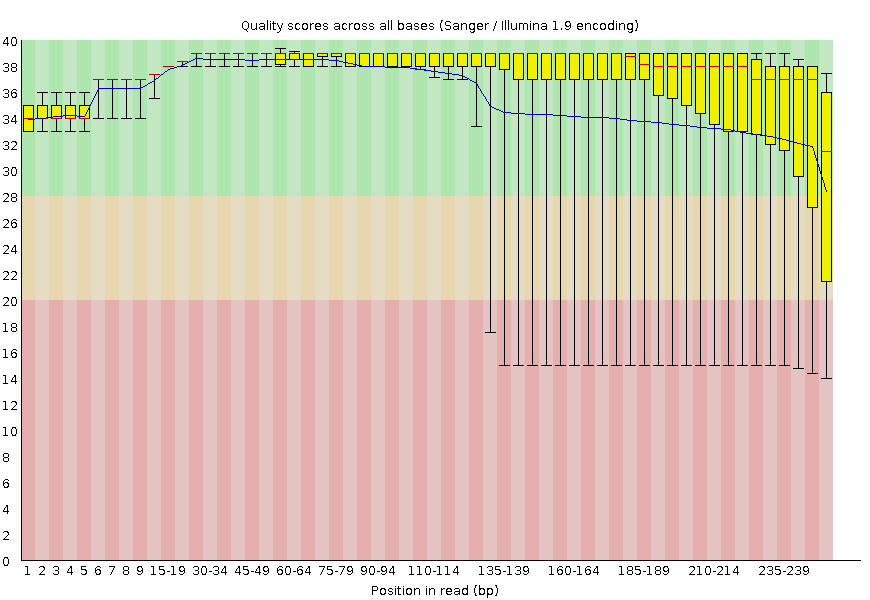

#### R1 filtrado
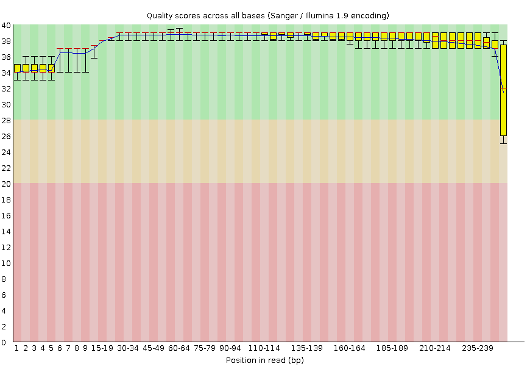

#### R2 crudo
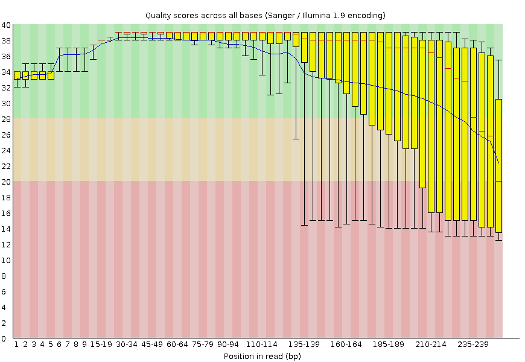

#### R2 filtrado
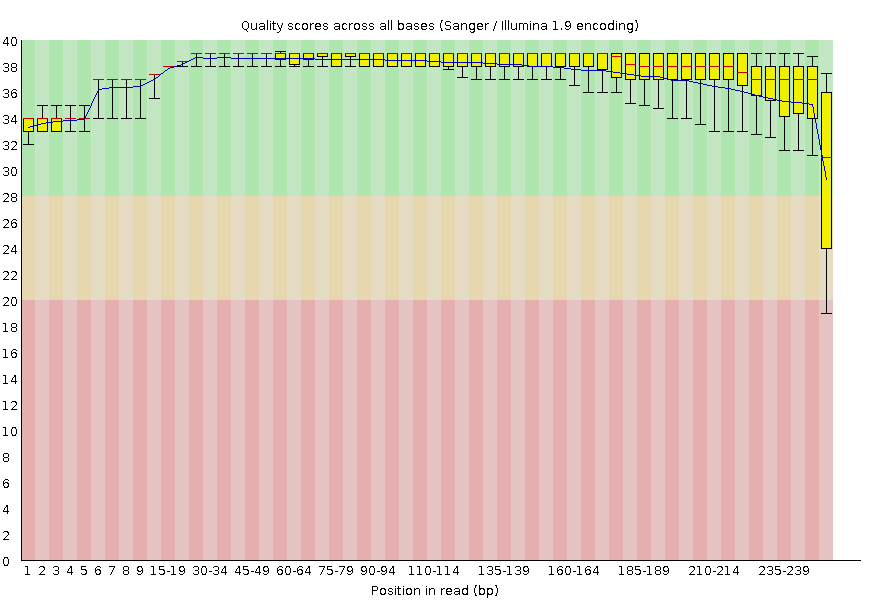

**Interpretación:**  
En R1 crudo la calidad por base ya era buena y obtuvo `PASS`, resultado que se mantuvo después del filtrado. En cambio, R2 crudo presentó una mayor disminución de la calidad hacia el final de las lecturas, por lo que obtuvo `WARNING`. Después del filtrado, R2 pasó a `PASS`, lo que muestra que el trimming permitió eliminar o recortar principalmente las regiones de menor calidad.

### 6.2 Contenido de bases por posición

#### R1 crudo
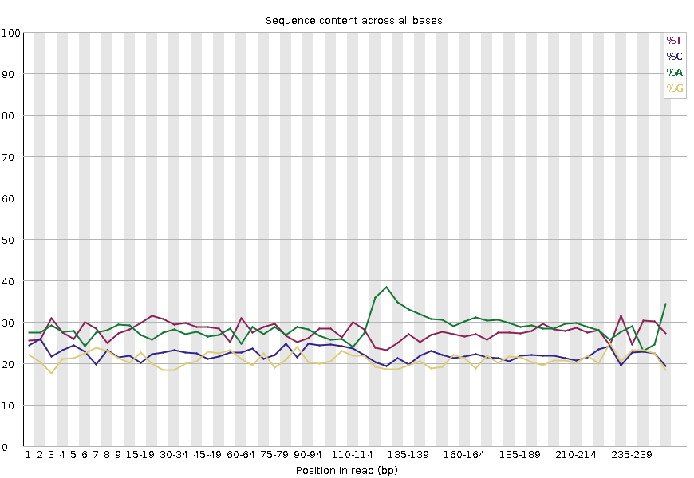

#### R1 filtrado
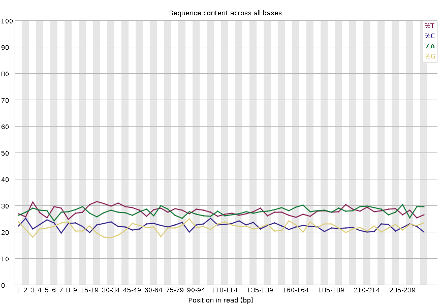

#### R2 crudo
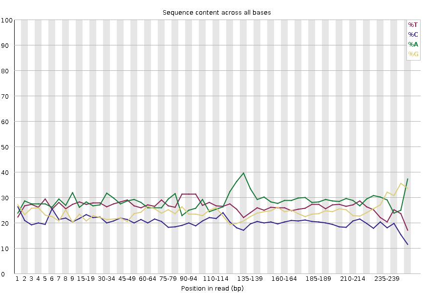

#### R2 filtrado
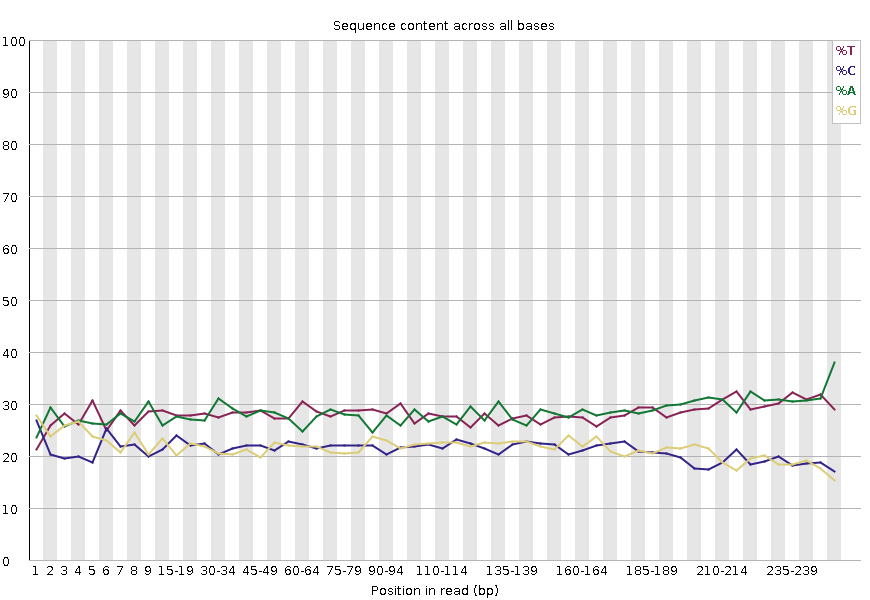

**Interpretación:**  
En las secuencias crudas se observaron algunas diferencias en la proporción de A, T, C y G según la posición dentro del read. R1 crudo presentó `WARNING`, mientras que R2 crudo presentó `FAIL`. Después del filtrado, ambos archivos pasaron a `PASS`, mostrando una composición de bases más estable a lo largo de las lecturas.

### 6.3 Contenido de adaptadores

#### R1 crudo
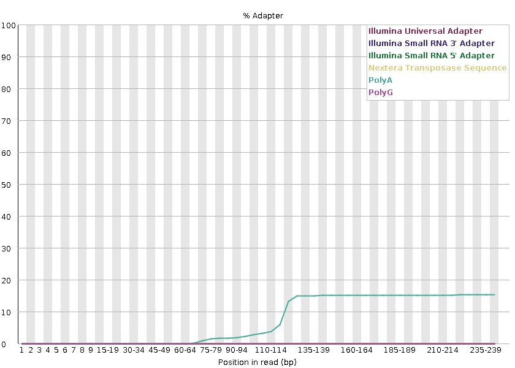

#### R1 filtrado
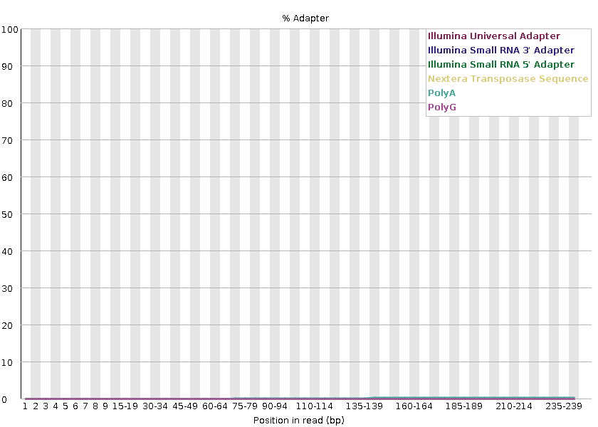

#### R2 crudo
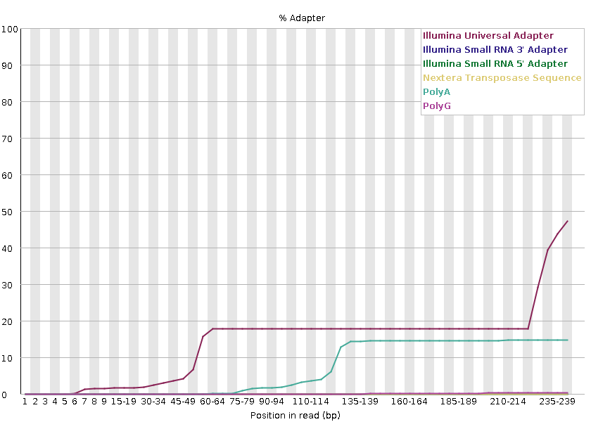

#### R2 filtrado
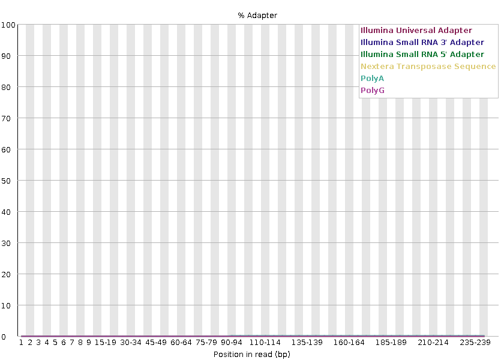

Interpretación:
Tanto R1 como R2 crudos presentaron `FAIL` por la presencia de secuencias correspondientes a adaptadores, principalmente hacia el final de los reads. Después del filtrado, ambos pasaron a `PASS`, lo que muestra que el proceso de poda fue efectivo para eliminar gran parte de los adaptadores presentes en las secuencias originales.

### 6.4 Distribución de longitud de las secuencias

#### R1 crudo
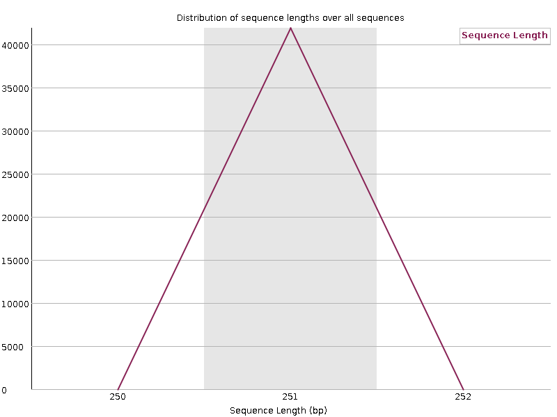

#### R1 filtrado
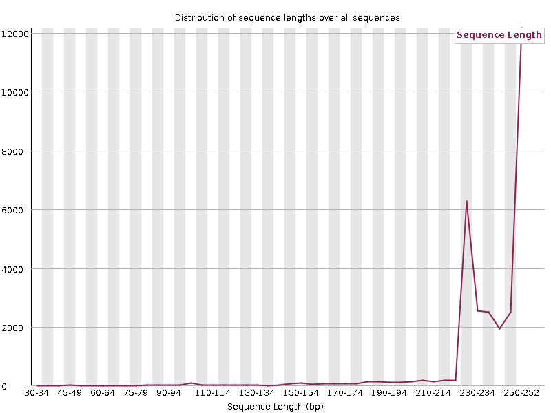

#### R2 crudo


#### R2 filtrado
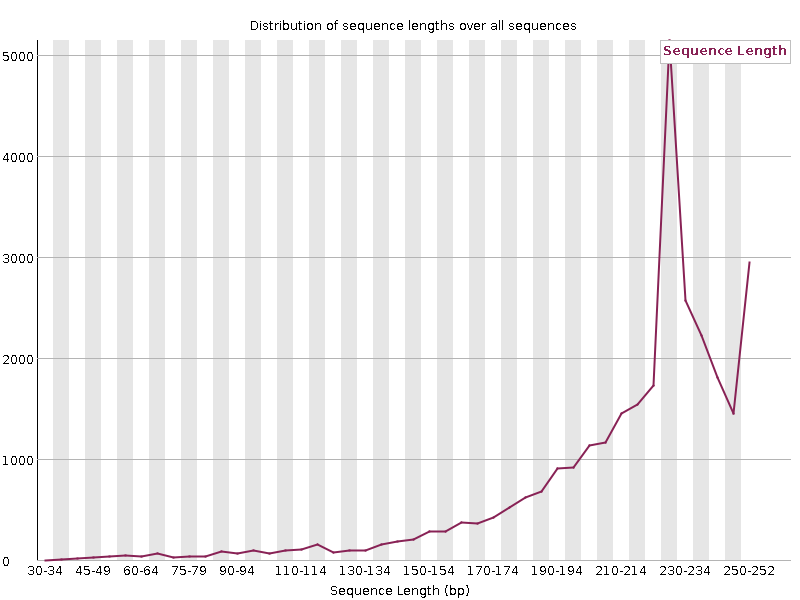

Interpretación: 
Antes del filtrado, tanto R1 como R2 tenían lecturas de 251 pb y este módulo obtuvo `PASS`. Después del trimming, las secuencias quedaron con longitudes variables entre 35 y 251 pb, por lo que el resultado cambió a `WARNING`. Esto es esperable, ya que no todas las lecturas fueron recortadas en la misma cantidad.

### Conclusión

En general, el filtrado mejoró varios parámetros de calidad. El cambio más claro se observó en R2, donde la calidad por base pasó de `WARNING` a `PASS`. También se observó una mejora en la composición de bases por posición y en la eliminación de adaptadores tanto en R1 como en R2.

Como consecuencia del trimming, disminuyó el número de reads y las secuencias quedaron con diferentes longitudes. A pesar de estas mejoras, algunos parámetros de FastQC, como la duplicación, las secuencias sobrerrepresentadas y la distribución de GC, siguieron mostrando algunas alertas.

## Conclusión general

En esta tarea aprendí a trabajar de manera más práctica con archivos de secuenciación y a entender mejor la información que contienen los archivos FASTQ. A partir de comandos de Unix pude revisar las secuencias, contar el número de reads, identificar la estructura de una lectura y relacionar los símbolos de calidad con sus valores PHRED. También pude trabajar con el archivo de regiones blanco para identificar las regiones y genes presentes.

Además, el uso de FastQC permitió observar de forma gráfica la calidad de las secuencias R1 y R2 y comparar los datos crudos con los datos podados. Esta comparación permitió entender mejor el efecto del filtrado, ya que se eliminaron adaptadores y regiones de menor calidad, aunque también disminuyó el número de reads y se generaron secuencias de diferentes longitudes. Los valores de reads calculados manualmente coincidieron con los informados por FastQC, lo que permitió comprobar que el procedimiento realizado con los comandos de Unix fue correcto.

Durante el desarrollo de la tarea se utilizaron varios comandos revisados en clases, como `head`, `tail`, `wc`, `grep` y el uso de pipes (`|`). Sin embargo, también fue necesario buscar algunas herramientas adicionales que no aparecían en los ejemplos revisados, como `zcat`, que permitió trabajar con archivos comprimidos `.gz`, y `sort -u`, que permitió obtener una lista de genes sin repeticiones. También se revisaron otras alternativas para resolver algunos pasos, lo que ayudó a comprender que en bioinformática muchas veces existen diferentes formas de llegar a un mismo resultado.

En general, esta tarea me permitió no solo ejecutar comandos, sino también comprender mejor para qué sirven, cómo se relacionan con los datos de secuenciación y cómo buscar nuevas herramientas cuando los comandos vistos en clase no son suficientes para resolver un problema.
